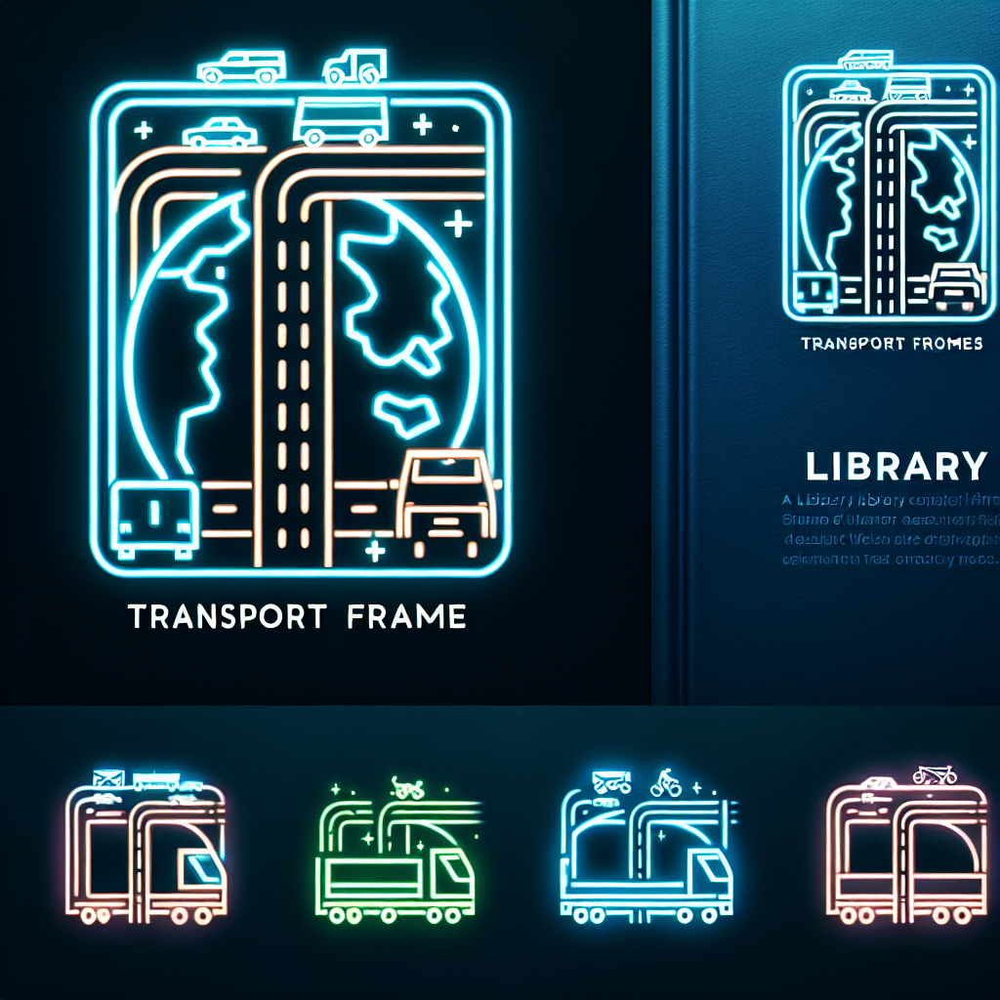

# transport_frames

[](https://www.repostatus.org/#active)
[](https://youtu.be/X34ZmkeZDos?si=4dH7iC5DkZeR7J4j)
[](https://pypi.org/project/scikit-learn/)
[](https://github.com/psf/black)
<!-- [](https://github.com/alexandermorozzov/transport_frames/actions/workflows/tests.yml) -->

<!-- [](https://youtu.be/X34ZmkeZDos?si=4dH7iC5DkZeR7J4j) -->

С помощью этой библиотеки можно собрать транспортные каркасы и транспортные коридоры для регионов
#

### Установка:
```pip install git+https://github.com/alexandermorozzov/transport_frames.git```
#

###### TODO: отказаться от momepy
###### TODO: использовать pre-commit (чтобы гонять линтеры-форматтеры и тесты во время коммита)
###### TODO: сделать нормальные логи через логуру
###### TODO: добавить тесты на транспортные каркасы и транспортные коридоры и прочее
###### TODO: использовать pylint & black 
###### TODO: добавить документацию
###### TODO: избавиться от magic numbers
###### TODO: не использовать файлы которые нельзя получить через библиотеку внутри pipeline -- невозможно проверить и запустить